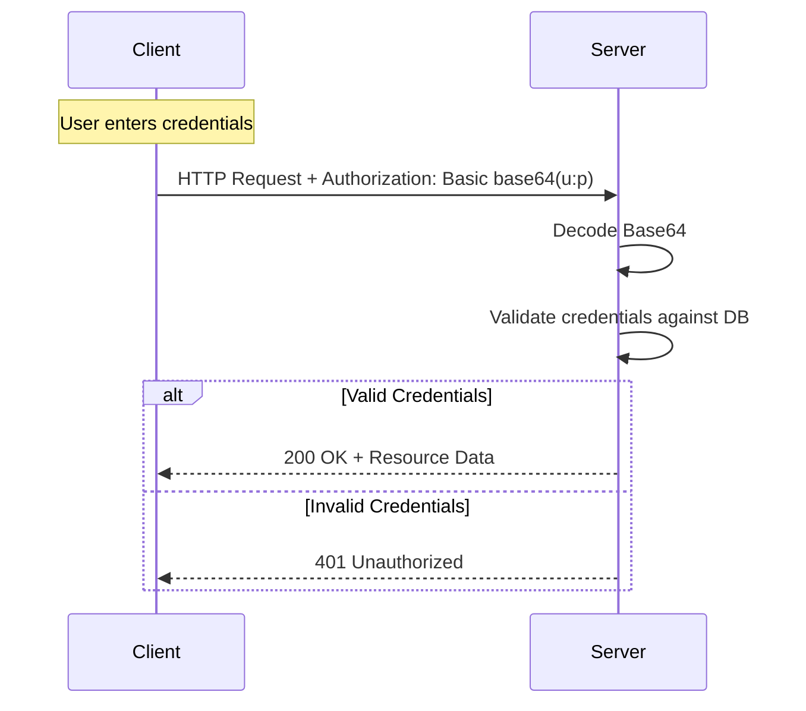

# 1️⃣ Basic Authentication (Basic Auth)

Basic Authentication is the simplest method for enforcing access control. It relies on the browser/client sending a Base64-encoded string of `username:password` in every request.

## 🔹 Sequence Diagram

## 🔹 Core Mechanics
The client sends the `Authorization` header:
`Authorization: Basic <base64(username:password)>`

> [!CAUTION]
> **Base64 is NOT encryption!** It is an encoding scheme. Any interceptor can decode it using `atob()`. **HTTPS is mandatory.**

## 🔹 Common Pitfalls ❌
- **Security Leak**: Sending credentials on *every* request increases exposure.
- **No Logout**: Browsers cache Basic Auth credentials. To "logout", you must overwrite the header or close the browser.
- **Phishing**: Traditional browser-native popups look generic and are easily spoofed.

## 🔹 Industry Best Practices ✅
1. **Always use TLS/SSL (HTTPS)**: To prevent MITM (Man-in-the-Middle) attacks.
2. **Short-lived Local Storage**: If implementing a custom UI, don't keep passwords in plain text in JS memory longer than needed.
3. **Use for Internal Services**: Ideal for machine-to-machine (M2M) communication behind a firewall or simple admin panels.

## 🔹 Interview Tips 💡
- **Q: How do you log out from Basic Auth?**
  - A: Technically, the server cannot force a logout. The client must either send incorrect credentials (to overwrite the cache) or the browser session must be cleared.
- **Q: Is Basic Auth stateless?**
  - A: Yes. The server doesn't need to store a session; it validates the credentials with every incoming request.
- **Q: Why use Base64 if it's not secure?**
  - A: It's used to ensure the credentials conform to HTTP header character requirements (printable ASCII), not for security.
