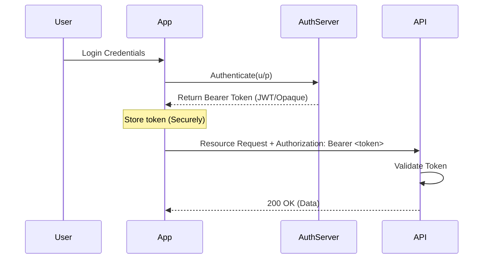

# 2️⃣ Bearer Token Authentication

Bearer Authentication (also called token authentication) is an HTTP authentication scheme that involves security tokens called bearer tokens. The name "Bearer" means that anybody who *bears* this token can use it to access resources.

## 🔹 Sequence Diagram

## 🔹 Key Concepts
The client sends the token in the `Authorization` header:
`Authorization: Bearer <token>`

## 🔹 Common Pitfalls ❌
- **Token Theft**: If the token is stolen (XSS), the attacker has full access until it expires.
- **CSRF vs XSS**: Storing tokens in `localStorage` makes them vulnerable to XSS. Storing in `HttpOnly` cookies protects against XSS but requires CSRF protection.
- **Statelessness Risk**: Hard to revoke a token server-side if it's stateless (JWT) without additional blacklisting logic.

## 🔹 Industry Best Practices ✅
1. **Short Expiry**: Keep access tokens short-lived (5-15 mins).
2. **Refresh Tokens**: Use refresh tokens to get new access tokens without re-prompting the user.
3. **Strict Transports**: Only send tokens over HTTPS.
4. **Validation**: Always validate the token on every request, either locally (JWT) or via introspection (Opaque).

## 🔹 Interview Tips 💡
- **Q: What happens if a Bearer token is intercepted?**
  - A: The attacker can gain full access to the user's resources. This is why TLS and short expiration times are critical.
- **Q: Is a Bearer token always a JWT?**
  - A: No. It can be a random "Opaque" string that the server looks up in a database (reference token).
- **Q: How does Bearer Auth differ from Basic Auth?**
  - A: Basic Auth sends the user's secret (password) with every request. Bearer Auth sends a temporary, revocable security token.
