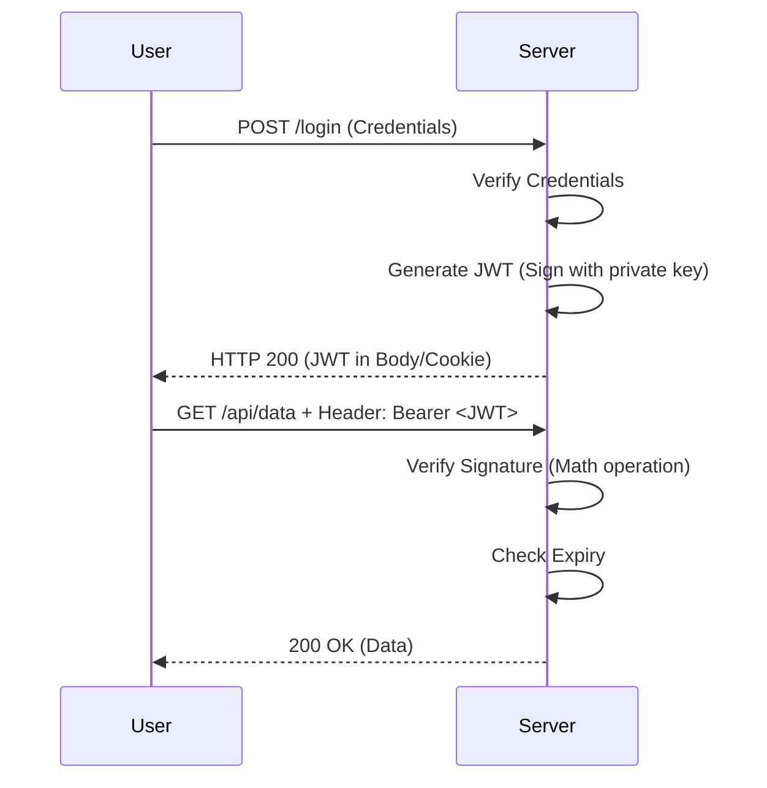

# 3️⃣ JWT (JSON Web Token)

JSON Web Token (JWT) is a compact, URL-safe means of representing claims to be transferred between two parties. It is the backbone of modern stateless authentication.

## 🔹 Structure Anatomy

A JWT is composed of three parts separated by dots (`.`):

1.  **Header**: Algorithm and token type.
2.  **Payload**: The "Claims" (User ID, Name, Roles, Expiry).
3.  **Signature**: Hash of Header + Payload + Secret.

```mermaid
graph TD
    JWT[JWT String] --> H[Header.base64]
    JWT --> P[Payload.base64]
    JWT --> S[Signature.base64]
    
    H -- Decodes to --> HJson[{"alg": "HS256", "typ": "JWT"}]
    P -- Decodes to --> PJson[{"sub": "123", "role": "Admin", "exp": 1715000}]
```

## 🔹 Auth Flow



## 🔹 Common Pitfalls ❌
- **Sensitive Data in Payload**: Never put passwords or PII in the payload; it's only base64 encoded and readable by anyone.
- **Weak Secret**: Using a short secret makes the signature susceptible to brute-force attacks.
- **Ignoring Expiry**: Failing to validate the `exp` claim allows tokens to be used forever.

## 🔹 Industry Best Practices ✅
1. **Use RS256**: Asymmetric signing (Public/Private key) is more secure than HS256 (Shared Secret) in distributed systems.
2. **Keep it Small**: Large JWTs increase latency and bandwidth usage.
3. **Audience/Issuer Validation**: Always check `aud` and `iss` claims to prevent "confused deputy" attacks.

## 🔹 Interview Tips 💡
- **Q: Why is JWT called stateless?**
  - A: Because the server doesn't need to store session data. Everything needed to identify the user is contained within the token itself.
- **Q: How can you invalidate a JWT?**
  - A: Since it's stateless, you can't "delete" it from the server. Common solutions include: short expiry times, or a "Deny List" in Redis.
- **Q: What is the difference between JWS and JWE?**
  - A: JWS (Signed) is readable but verified. JWE (Encrypted) is unreadable by humans and encrypted.
