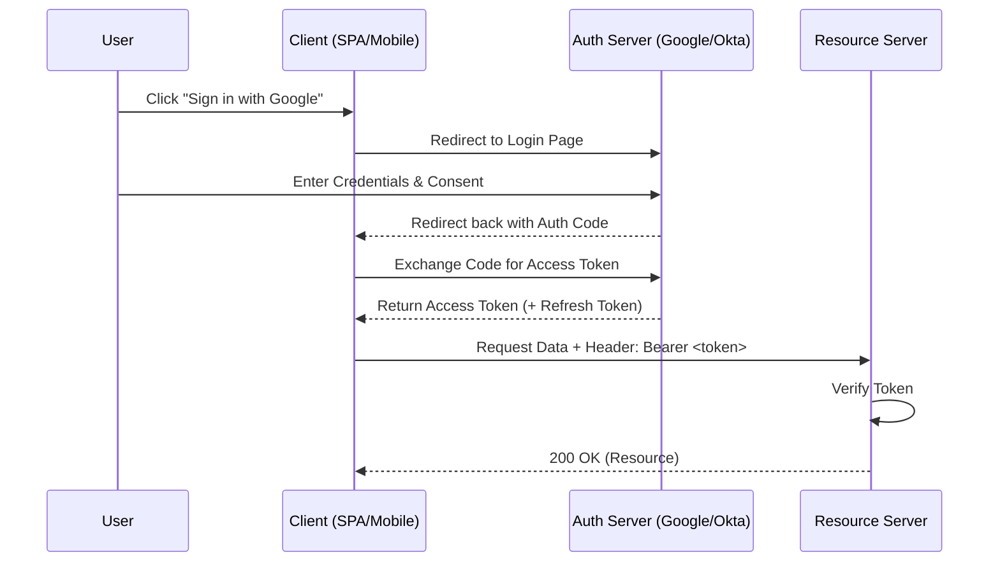

# 4️⃣ OAuth 2.0 (Authorization Framework)

OAuth 2.0 is the industry-standard protocol for **authorization**. It focuses on client developer simplicity while providing specific authorization flows for web applications, desktop applications, mobile phones, and living room devices.

## 🔹 Sequence Diagram (Authorization Code Flow)

## 🔹 Core Roles
1.  **Resource Owner**: The User who owns the data.
2.  **Resource Server**: The API hosting the data.
3.  **Client**: The App requesting access to the data.
4.  **Authorization Server**: The Server issuing tokens (Google, IdentityServer, etc.).

## 🔹 Common Pitfalls ❌
- **Exposing Client Secret**: Never put the `client_secret` in a frontend app (SPA/Mobile). Use **PKCE** instead.
- **Insecure Redirects**: Using wildcard redirect URIs allows attackers to steal auth codes.
- **Scope Creep**: Requesting more permissions than necessary (`*` scopes).

## 🔹 Industry Best Practices ✅
1.  **Use PKCE**: Proof Key for Code Exchange is mandatory for all modern OAuth flows, even server-side ones.
2.  **Short-lived Access Tokens**: Use tokens that last only minutes.
3.  **Rotate Refresh Tokens**: Invalidate old refresh tokens when a new one is issued (Token Rotation).
4.  **OIDC**: Use OpenID Connect on top of OAuth for identity (authentication).

## 🔹 Interview Tips 💡
- **Q: Is OAuth 2.0 an Authentication protocol?**
  - A: No, it's an **Authorization** framework. It grants access but doesn't technically tell you "who" the user is (that's what OIDC is for).
- **Q: What is PKCE and why is it used?**
  - A: PKCE prevents "Auth Code Interception" attacks. It uses a code verifier and challenge to ensure the app requesting the token is the same one that started the flow.
- **Q: What are Scopes?**
  - A: Scopes define the level of access the client is requesting (e.g., `read:profile`, `write:orders`).
