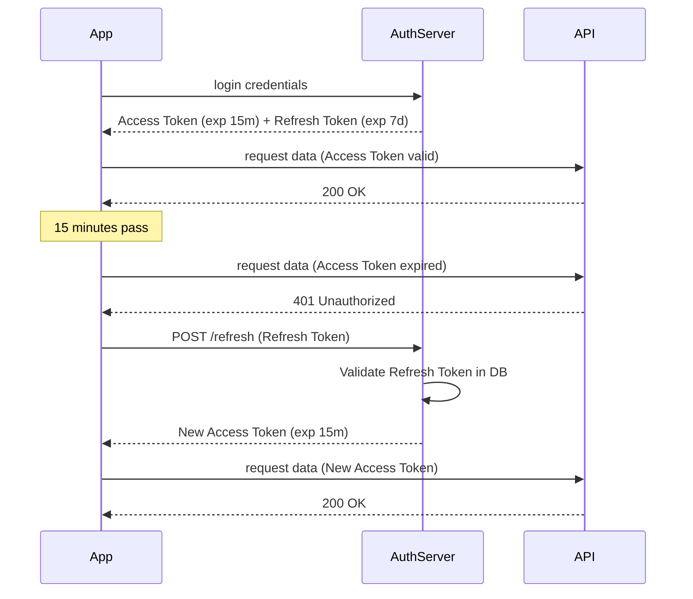

# 5️⃣ Access Token vs Refresh Token

This pattern balances security and user experience by using two different tokens with distinct lifespans and purposes.

## 🔹 Sequence Diagram

## 🔹 Token Characteristics

| Feature | Access Token | Refresh Token |
| :--- | :--- | :--- |
| **Lifespan** | Very Short (5-15 mins) | Long (days/weeks) |
| **Storage** | Memory / Secure Context | HttpOnly Cookie (Best) |
| **Usage** | Every API Request | Once per expiry |
| **Damage if Leaked** | Low (expires soon) | High (needs revocation) |

## 🔹 Common Pitfalls ❌
- **Infinite Refresh**: Never allowing refresh tokens to expire can lead to indefinite access if a device is stolen.
- **Storing in LocalStorage**: Refresh tokens are high-value targets; keeping them in `localStorage` is risky.
- **No Revocation System**: Not having a way to "Blacklist" or delete a refresh token when a user changes their password.

## 🔹 Industry Best Practices ✅
1.  **Refresh Token Rotation**: Issue a *new* refresh token every time one is used. This detects if two separate clients are using the same token (potential theft).
2.  **Absolute Expiry**: Set an absolute limit (e.g., 30 days) after which the user *must* log in manually.
3.  **Binding**: Bind the refresh token to the user's specific device or IP to prevent use on other machines.

## 🔹 Interview Tips 💡
- **Q: Why not just have a long-lived Access Token?**
  - A: Short-lived access tokens limit the window of opportunity for an attacker if a token is intercepted. It also allows for nearly instant logout (by revoking the refresh token).
- **Q: What is "Token Rotation"?**
  - A: It's the practice of replacing the refresh token with a new one on every use. If an old one is reused, the server knows a breach occurred and can invalidate all tokens for that user.
