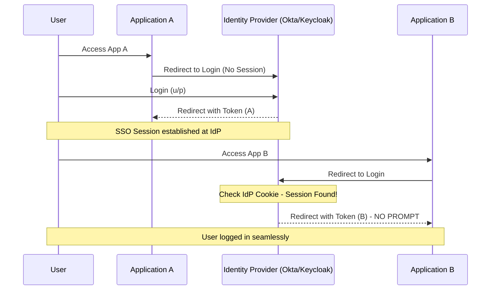

# 6️⃣ SSO (Single Sign-On)

SSO is an authentication scheme that allows a user to log in with a single ID to any of several related, yet independent, software systems.

## 🔹 Sequence Diagram (Centralized Identity)

## 🔹 Core Technologies
1.  **SAML 2.0**: The enterprise veteran (XML based).
2.  **OpenID Connect (OIDC)**: The modern standard (JSON/OAuth based).
3.  **CAS**: Central Authentication Service.

## 🔹 Common Pitfalls ❌
- **Single Point of Failure**: if the Identity Provider (IdP) goes down, access to *all* apps is lost.
- **Complexity**: Synchronizing user attributes (claims) across different service providers can be difficult.
- **Session Mismatch**: User logs out of App A, but is still logged in to App B (Global Logout is hard to implement).

## 🔹 Industry Best Practices ✅
1.  **Global Logout**: Implement Back-channel logout so all SPs are notified when a user signs out.
2.  **Standard Protocols**: Don't roll your own SSO; use OIDC or SAML.
3.  **MFA at IdP**: Enforce Multi-Factor Authentication at the Identity Provider level to protect all downstream apps.

## 🔹 Interview Tips 💡
- **Q: What is the difference between SSO and OAuth?**
  - A: OAuth is about *authorization* (accessing data). SSO is about *authentication* (user identity) across multiple applications.
- **Q: How does the IdP know the user is logged in for the second app?**
  - A: When the user logged in for the first app, they established a session (cookie) with the Identity Provider domain. When redirected for the second app, the browser sends that cookie back to the IdP.
