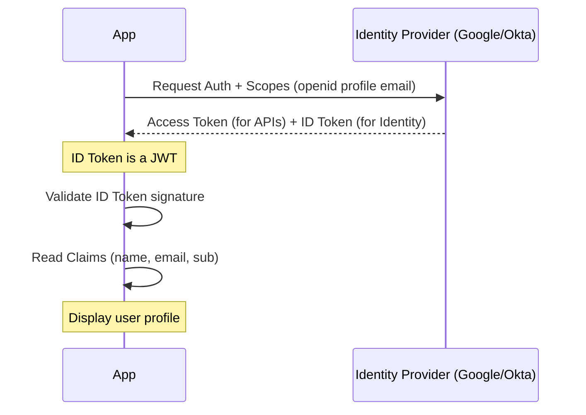

# 7️⃣ OpenID Connect (OIDC)

OpenID Connect (OIDC) is an identity layer on top of the OAuth 2.0 protocol. While OAuth 2.0 is about *authorizing* access (API access), OIDC is about *authentication* (Who is the user?).

## 🔹 Sequence Diagram

## 🔹 OIDC = OAuth 2.0 + ID Token
The **ID Token** is the key difference. It is always a JWT and contains info about the authentication event (when, how, who).

## 🔹 Common Pitfalls ❌
- **Scope Missing**: Forgetting to add the `openid` scope. Without it, you are just doing plain OAuth.
- **Not Validating `nonce`**: The `nonce` claim protects against replay attacks. Not checking it is a security risk.
- **Assuming Identity from Access Token**: Never use the `AccessToken` to identify a user. Always use the `ID Token`.

## 🔹 Industry Best Practices ✅
1.  **Use ID Token for UI**: Only use information from the ID Token to display the user's name or profile picture.
2.  **Discovery Document**: Use the `/.well-known/openid-configuration` endpoint to automatically configure endpoints and keys.
3.  **Client-Side Validation**: SPA apps should validate the ID Token locally before trusting it for UI display.

## 🔹 Interview Tips 💡
- **Q: What is the main difference between OAuth and OIDC?**
  - A: OAuth provides an *Access Token* (a key to a door). OIDC provides an *ID Token* (a passport/driver's license).
- **Q: What identifies a user across different OIDC providers?**
  - A: The `sub` (subject) claim is the unique identifier for a user within that provider.
- **Q: Why do we need the UserInfo endpoint if the ID Token has user data?**
  - A: The ID Token should be kept small for performance. More detailed data (like address or profile bio) can be fetched from the UserInfo endpoint.
