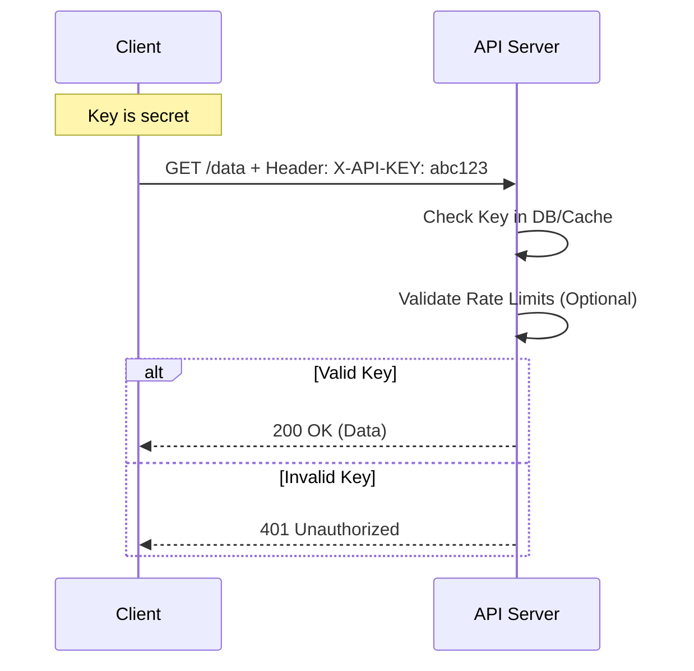

# 9️⃣ API Key Authentication

API Key authentication is a simple method where a static secret string is passed, typically in a header, to identify the calling application.

## 🔹 Sequence Diagram

## 🔹 Use Cases
- **Public APIs**: Identifying which developer is calling the service (e.g., Google Maps, Weather APIs).
- **Service-to-Service**: Simple internal communication where full OAuth is overkill.

## 🔹 Common Pitfalls ❌
- **Leaked Keys**: Developers often hardcode keys in client-side code (Angular/React). **Never** put keys in frontend code.
- **No Rotation**: Keys often last forever, making a leak permanent.
- **Lack of Identity**: API keys typically authenticate the *app*, not the *user*.

## 🔹 Industry Best Practices ✅
1.  **Header over Query**: Pass keys in the HTTP Header (`X-API-KEY`), not the URL (which is logged in access logs).
2.  **Rate Limiting**: Always pair API keys with rate limiting to prevent abuse.
3.  **Rotation Support**: Let users generate multiple keys and delete old ones without downtime.

## 🔹 Interview Tips 💡
- **Q: Is an API key enough for secure user authentication?**
  - A: No. An API key is an "identifier" for a client. It doesn't prove the identity of a specific user.
- **Q: What is the risk of using API keys in a Frontend application?**
  - A: Anyone can view the source code, extract the key, and use it to consume the API quotas or access data under the app's name.
- **Q: How do you secure an API key in a Backend system?**
  - A: Use environment variables, secret managers (Azure Key Vault, AWS Secrets Manager), and hashing if storing keys in a database.
