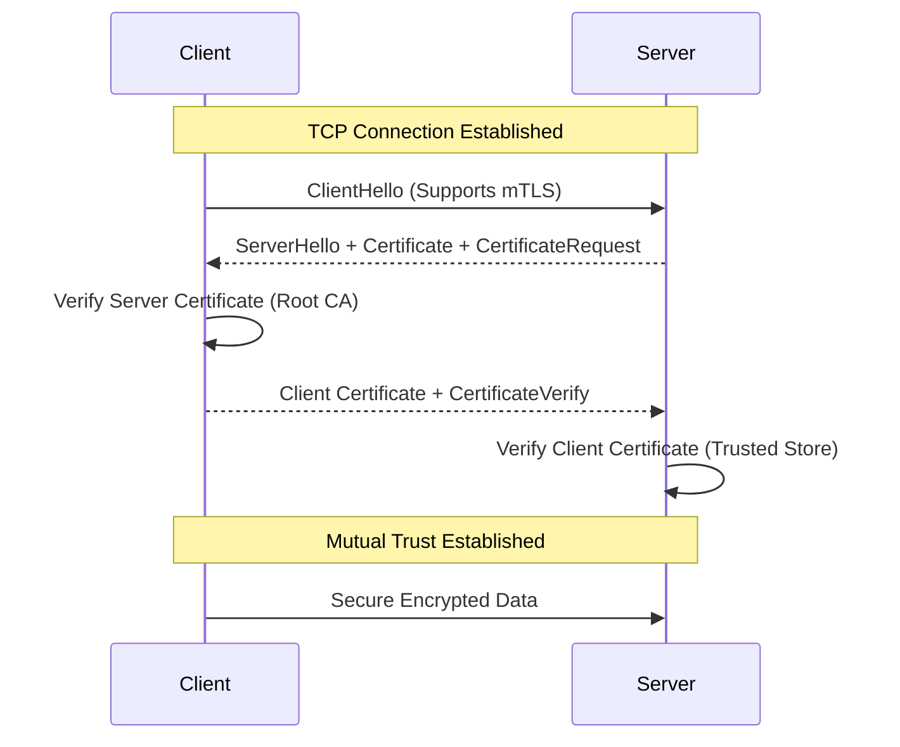

# 🔟 Mutual TLS (mTLS)

Mutual TLS (mTLS) is a method for mutual authentication. In standard TLS (HTTPS), only the server proves its identity. In mTLS, **both** the client and the server verify each other using certificates.

## 🔹 Sequence Diagram (Full Handshake)

## 🔹 Key Concepts
- **Certificate Authority (CA)**: The entity that issues and signs certificates.
- **Client Certificate**: A certificate file installed on the user's machine/browser.
- **Zero Trust**: mTLS is a cornerstone of Zero Trust architecture (never trust, always verify).

## 🔹 Common Pitfalls ❌
- **Certificate Expiry**: Automating certificate renewal (using tools like Certbot or Vault) is critical. Expired certificates break connections immediately.
- **Revocation Check**: Not checking the CRL (Certificate Revocation List) allows revoked/stolen certificates to be used.
- **Complexity**: Distributing and managing certificates to thousands of end-users is difficult (better for machine-to-machine).

## 🔹 Industry Best Practices ✅
1.  **M2M Security**: Use mTLS for microservices communication inside a cluster (e.g., using a Service Mesh like Istio).
2.  **Hardware Tokens**: For high security, store client certificates on hardware security modules (HSM) or smart cards.
3.  **Short Lifespan**: Use short-lived certificates to minimize the impact of a compromised private key.

## 🔹 Interview Tips 💡
- **Q: How does mTLS differ from traditional TLS?**
  - A: In traditional TLS, the server is authenticated. In mTLS, both the client and server must provide and verify digital certificates.
- **Q: Why is mTLS rarely used for public websites?**
  - A: Because it requires users to install a client certificate in their browser, which is a poor user experience for general consumers.
- **Q: What happens if the Client Certificate is stolen?**
  - A: The attacker can impersonate the client until the certificate either expires or is added to a Revocation List (CRL/OCSP).
Lines: 55
