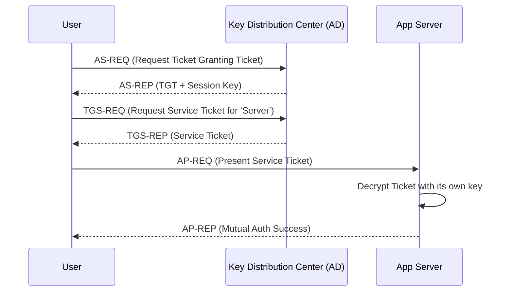

# 1️⃣1️⃣ Kerberos (Windows Authentication)

Kerberos is a ticket-based network authentication protocol designed to provide strong authentication for client/server applications by using secret-key cryptography.

## 🔹 Sequence Diagram

## 🔹 Core Components
1.  **TGT (Ticket Granting Ticket)**: Your "proof of identity" within the domain.
2.  **Service Ticket**: A ticket specifically for a single resource (e.g., a SQL server or Web app).
3.  **KDC (Key Distribution Center)**: The trusted third party (usually Active Directory).

## 🔹 Common Pitfalls ❌
- **SPN Mismatch**: If the Service Principal Name (SPN) is not correctly registered in Active Directory, authentication will fail with cryptic errors.
- **Time Sync**: Kerberos is extremely sensitive to time. If the client and server clocks differ by more than 5 minutes, it will fail.
- **Double Hop Problem**: Passing credentials from Web Server A to DB Server B (requires "Constrained Delegation").

## 🔹 Industry Best Practices ✅
1.  **Use Negotiate**: Use the `Negotiate` scheme in HTTP, which attempts Kerberos and falls back to NTLM only if necessary.
2.  **Managed Service Accounts (gMSA)**: Use gMSAs for your application pool identities to avoid manual SPN and password management.
3.  **Modernize**: In web-facing scenarios, wrap Kerberos inside OIDC/SAML via an Identity Provider for better flexibility.

## 🔹 Interview Tips 💡
- **Q: Is Kerberos stateless?**
  - A: No. It creates a "Security Context" for the session, though the tickets themselves carry the identity data.
- **Q: What is the "Golden Ticket" attack?**
  - A: It's a critical exploit where an attacker steals the KDC's master key and creates tickets for any user with any level of access.
- **Q: Why does Kerberos need a timestamp?**
  - A: To prevent "Replay Attacks" where an attacker captures a ticket and tries to use it later.
