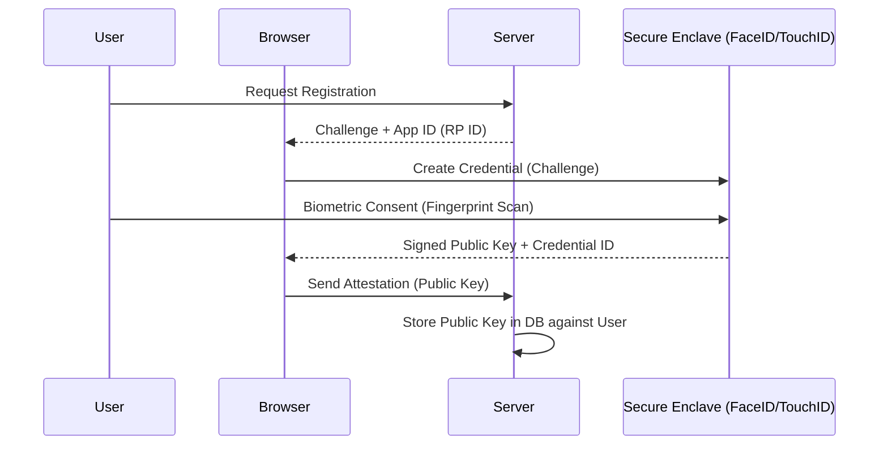
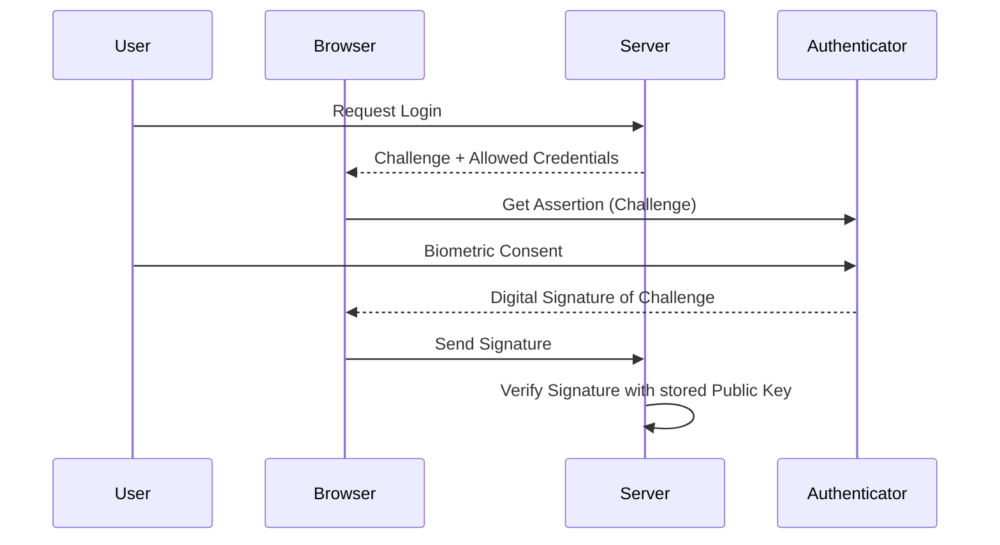

# 1️⃣2️⃣ Biometric Authentication (WebAuthn / FIDO2)

Biometric authentication uses unique biological traits—like fingerprints or facial recognition—to verify identity. On the web, this is implemented using the **WebAuthn** standard.

## 🔹 Sequence Diagram (Registration)

## 🔹 Sequence Diagram (Authentication)

## 🔹 Why is it Secure?
- **Public/Private Key**: The server only stores the **Public Key**. The **Private Key** never leaves the user's device (Secure Enclave).
- **Anti-Phishing**: WebAuthn is bound to a specific domain (Origin). A fake site cannot trigger the biometric prompt for the real site.
- **No Passwords**: There is no secret on the server to be leaked.

## 🔹 Common Pitfalls ❌
- **Browser Support**: While broad, some older browsers don't support WebAuthn API.
- **Backup**: If a user loses their device (biometric key), how do they get back in? Recovery keys or secondary MFA is a must.
- **Implementation Complexity**: Handling the binary data (CBOR/COSE) encoding correctly is difficult without a library.

## 🔹 Industry Best Practices ✅
1.  **Passwordless First**: Use biometrics to replace passwords entirely for a "magical" UX.
2.  **Platform Authenticators**: Prioritize built-in sensors (FaceID/Windows Hello) over external security keys (YubiKeys) for ease of use.
3.  **Resident Keys**: Allow users to log in just by their biometrics without even entering a username (Discoverable Credentials).

## 🔹 Interview Tips 💡
- **Q: Does the server receive the user's fingerprint?**
  - A: **No.** The server never sees the biometric data. It only receives a cryptographic signature proving the biometric was successful.
- **Q: Is WebAuthn part of OAuth?**
  - A: No. WebAuthn is a separate W3C standard for browser-to-authenticator interaction. However, they can be used together (e.g., WebAuthn for the login screen of an OIDC IdP).
