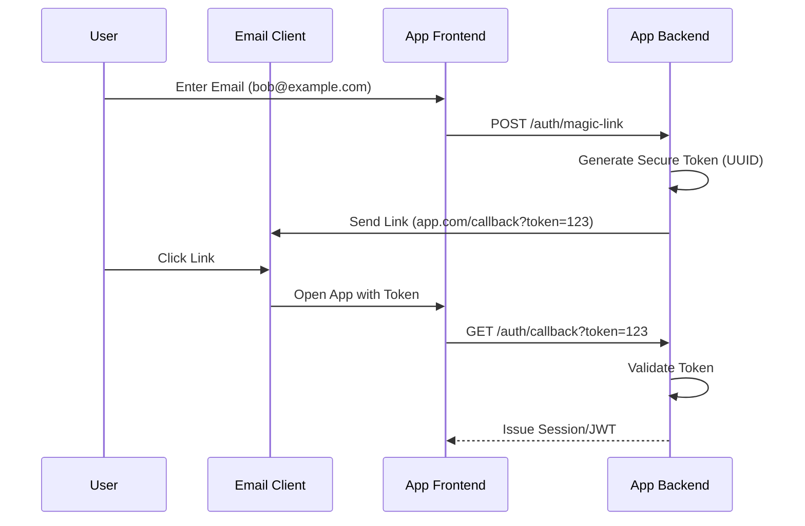

# 1️⃣3️⃣ Passwordless Authentication

Passwordless authentication eliminates the need for users to remember passwords. Common methods include Magic Links (Email) and One-Time Passwords (OTP/SMS).

## 🔹 Sequence Diagram (Magic Link)

## 🔹 Core Benefits
- **Zero Friction**: No "Forgot Password" loops.
- **Improved Security**: No password database to be leaked! Authenticating via email relies on the user's email security.
- **Phishing Resistant**: (If using WebAuthn/Magic Links with device binding).

## 🔹 Common Pitfalls ❌
- **Email Latency**: If the magic link takes 5 minutes to arrive, the user might give up.
- **Security of Email**: If the user's email is compromised, their account is compromised.
- **One-click Scanners**: Some corporate email filters "click" links to scan for viruses, potentially invalidating the one-time token before the user sees it.

## 🔹 Industry Best Practices ✅
1.  **Short TTL**: Magic links should expire within 10-15 minutes.
2.  **One-Time Use**: Invalidate the token immediately after the first successful verification.
3.  **Cross-Device Handling**: If a user requests a link on mobile but clicks it on desktop, ensure the session is handled correctly (e.g., via polling or real-time web-sockets).

## 🔹 Interview Tips 💡
- **Q: How do you prevent email "Link Scanners" from breaking magic links?**
  - A: Use a "Land and Click" approach. The link goes to a page with a "Click to Login" button rather than performing the login immediately on GET.
- **Q: Is Passwordless more secure than Passwords?**
  - A: Generally, yes. It prevents credential stuffing and brute-force attacks. However, it shifts the security burden to the user's email/phone provider.
- **Q: What is a "Naked" OTP?**
  - A: It's an OTP sent in the clear (SMS). It is vulnerable to SIM swapping and interception.
Lines: 50
