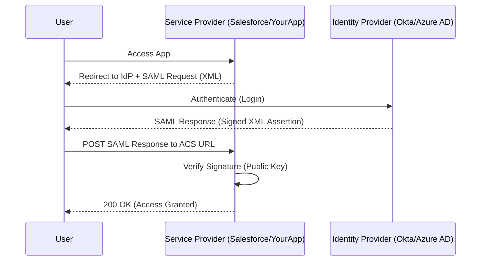

# 1️⃣4️⃣ SAML (Security Assertion Markup Language)

SAML is an XML-based open standard for exchanging authentication and authorization data between parties, in particular, between an **Identity Provider (IdP)** and a **Service Provider (SP)**.

## 🔹 Sequence Diagram (Web Browser SSO Profile)

## 🔹 Key Terms
1.  **Assertion**: The XML package containing user identity and attributes.
2.  **Metadata**: An XML file used to bridge trust between SP and IdP (contains URLS and Keys).
3.  **Binding**: The method of transport (HTTP Redirect or HTTP POST).

## 🔹 Common Pitfalls ❌
- **Clock Skew**: SAML assertions have a "NotBefore" and "NotOnOrAfter" timestamp. If clocks aren't synced, the assertion will be rejected.
- **XML Signature Wrapping**: A security vulnerability where an attacker modifies the XML but keeps a valid signature.
- **Metadata Management**: Forgetting to update certificates in the metadata before they expire will break SSO for all users.

## 🔹 Industry Best Practices ✅
1.  **Signature Verification**: Always verify the signature of the *entire* SAML Response AND the individual Assertion.
2.  **Request Signing**: Sign the SAML AuthN Request so the IdP can verify it's coming from your legitimate app.
3.  **Force HTTPS**: SAML should NEVER be used over unencrypted HTTP.

## 🔹 Interview Tips 💡
- **Q: What is the primary difference between SAML and OIDC?**
  - A: SAML is XML-based and older/more established in classic Enterprise environments. OIDC is JSON/JWT-based and more web/mobile-friendly.
- **Q: What is an ACS URL?**
  - A: The Assertion Consumer Service URL is the endpoint on your app (the SP) where the IdP sends the SAML assertion after the user logs in.
- **Q: Why does SAML use a browser POST to send the token?**
  - A: To avoid URL length limits and to prevent the sensitive XML assertion from being stored in browser history or server access logs (as a GET parameter would be).
Lines: 50
