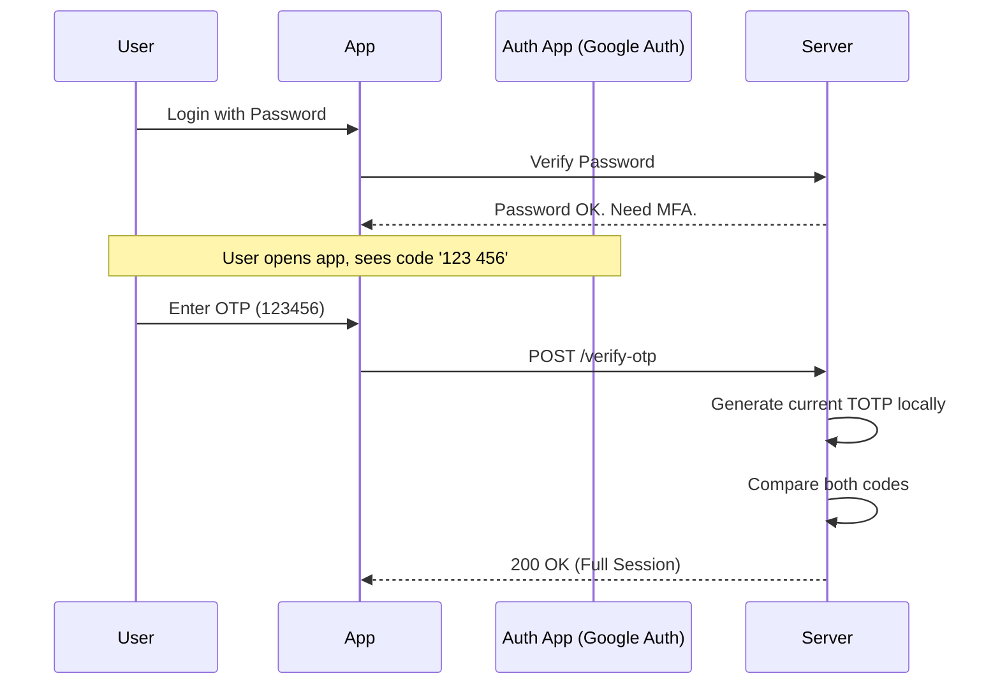

# 1️⃣5️⃣ MFA / 2FA (Multi-Factor Authentication)

MFA adds an extra layer of security by requiring two or more independent factors for authentication.

## 🔹 Knowledge, Possession, Inherence
1.  **Knowledge**: Something you **know** (Password, PIN).
2.  **Possession**: Something you **have** (Phone, Hardware Key, Email).
3.  **Inherence**: Something you **are** (Fingerprint, FaceID).

## 🔹 Sequence Diagram (TOTP Flow)

## 🔹 MFA Methods
- **TOTP**: Time-based One-Time Password (App-based). Best for offline use.
- **SMS/Email**: Easy but vulnerable to interception/SIM swapping.
- **Push**: One-tap approval (e.g., Microsoft Authenticator). Excellent UX.

## 🔹 Common Pitfalls ❌
- **No Backup Codes**: If a user loses their phone, they are locked out forever.
- **Window of Acceptance**: TOTP should allow a small window (e.g., +/- 30 seconds) to account for clock drift.
- **Reuse**: OTP codes must be one-time use. Even if it's still within the 30-second window, it should be invalidated after the first use.

## 🔹 Industry Best Practices ✅
1.  **WebAuthn for MFA**: Use Biometrics as the second factor for the highest security.
2.  **Rate Limiting**: Aggressively rate limit OTP attempts to prevent brute-forcing.
3.  **Trust Device**: Allow users to "Trust this browser" for 30 days to reduce friction while keeping security high.

## 🔹 Interview Tips 💡
- **Q: What does the "T" in TOTP stand for?**
  - A: **Time-based**. It uses the current UNIX timestamp and a shared secret to calculate the 6-digit code.
- **Q: Why is SMS considered "weak" MFA?**
  - A: SMS messages are not encrypted and can be intercepted by hackers or through "SIM swapping" where an attacker convinces a telco to move the user's number to a new card.
- **Q: How does a TOTP app work without internet?**
  - A: Because the code is based on a **Shared Secret** (exchanged during setup) and the **Current Time**. As long as both the phone and server have the correct time, they will calculate the same code.
Lines: 55
